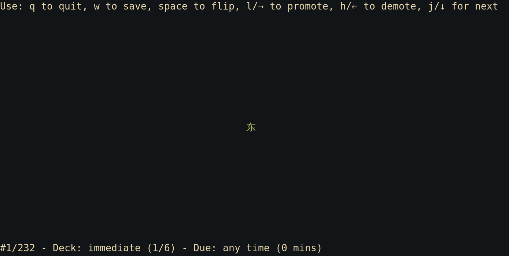

[](https://crates.io/crates/vocage)

# Introduction

Vocage is a simple terminal-based vocabulary-learning tool. It presents flashcards using a spaced-repetition algorithm
(e.g. Leitner); words you know well will be presented less and less frequently and words you have problems with will be
repeated more often. You quickly move cards/words between decks and each deck has an associated presentation interval.

You can use vocage for anything you'd use flashcards for and not necessarily limited
to learning languages.

The aim of this software is to keep things simple and minimalistic and to focus on one thing only (the unix philosphy).



## Features & non-features

* Data is stored in a **simple plain-text tab-separated values format** (TSV). So you can edit your cards in your favourite
  text editor or spreadsheet program (use CSV export and set delimiter to tab and quotes to none).
  Vocage itself does not provide editing facilities.
    * All lines starting with ``#`` are considered comments. This also serves to quickly disable some cards without
        actually deleting them.
* Your learning progress is stored right inside the TSV files, simply by added one column for the deck a card is in, and one for when it is due. This keeps
  everything in one place and makes it easy to process with external tools. You could keep your vocabulary sets in git, if you want.
* Configuration is done via **command line parameters** that *can also be stored as comments at the end of the TSV file for quick loading*:
    * The columns are defined either as a header line on the very first line (in upper case!),
      or more explicitly using ``--columns``.
    * You determine what columns to show on which side of the card using ``--showcards``, which can be invoked multiple
        times, once per side. Traditionally there's a front
        side and a back side to a card, but you can define as many sides as you want.
    * Define deck names and their intervals.
    * Sane defaults; if no configuration is specified some sane defaults will be used.
* Load multiple vocabulary files (TSV) together, provided they have the same column layout. This allows you
  to use files as an easy grouping mechanism (e.g. a file per level, per domain, or per word class).
* The 'fancy' TUI can be disabled by setting the ``--minimal`` parameter, in case you want to interact with vocage
  from shell scripts or other software.
* Proper unicode support
* Colour support, each column gets a colour (can be disabled in ``--minimal`` mode)
* Arrow keys and vim-style movements (hjkl)
* Written in Rust; fast & efficient

## Installation

Install vocage using Rust's package manager:

```
cargo install vocage
```

No cargo/rust on your system yet? Do ``sudo apt install cargo`` on Debian/ubuntu based systems, ``brew install rust`` on mac, or use [rustup](https://rustup.rs/).


## Usage

### Quick Start

Have some data in TSV format ready, for example [from here](https://github.com/proycon/vocadata):

```
$ vocage yourdata.tsv
```

### Key Bindings

* space / enter - 'Flip' the card, shows the next side (i.e. the solution)
* Arrow down / ``j`` - Keep card on the same deck and go to the next card (usually a random card unless you are in
  ordered mode)
* PageDown / ``J`` - Skip the card (it may be presented again immediately in the same session) and go to the next card (a random card will be selected)
* Arrow up / ``k`` - Skip this card for now and go to the previous card
* Arrow right / ``l`` - Promote this card to the next deck
* Arrow left / ``h`` - Promote this card to the previous deck
* A number key - Move the card to the n'th deck
* ``w`` - Save progress (input files will be amended)
* ``q`` - Quit, doesn't do any saving.
* ``a`` - Toggle between showing all cards and showing only cards that are due (default) (``--all``)
* ``s`` - Toggle between presenting unseen cards (default) and showing only cards that have been presented before.
  (``--seen``)
* `z` - Toggle between ordered mode and random mode (default) (`--ordered`). In ordered mode, cards will be presented in
  the order they are defined.


